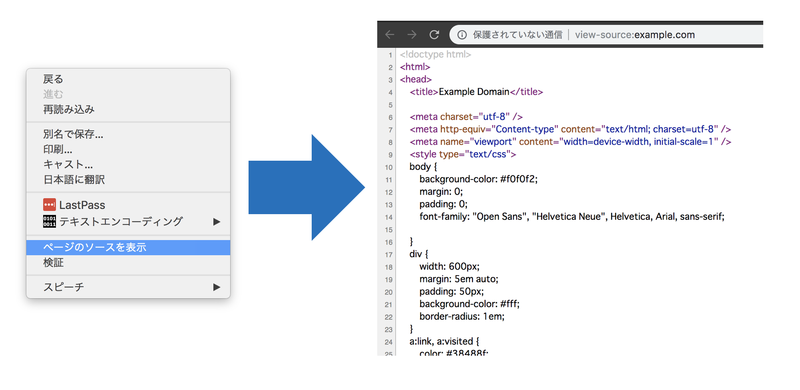
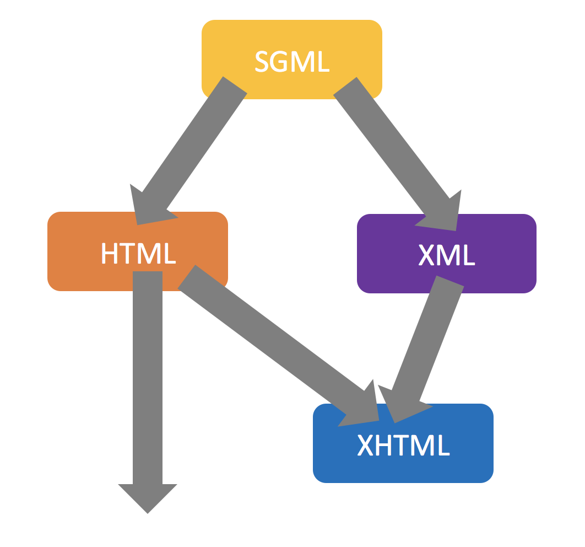
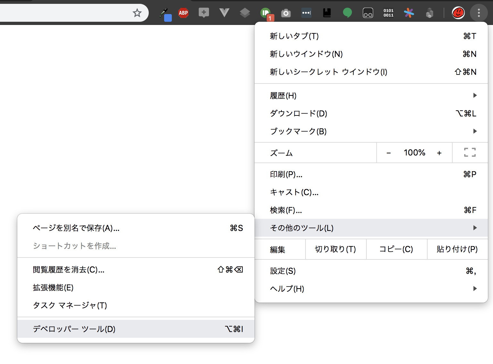
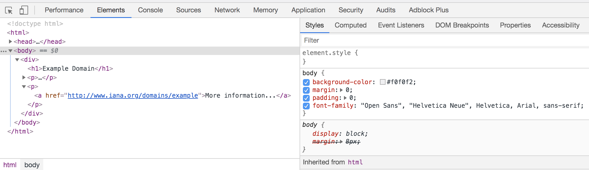

# HTMLとは

**HTML**とは, **Hyper Text Markup Language**の略称で, 平たく言うとWebページの構造を記述するためのマークアップ言語である.  
現在は**W3C**と**WHATWG**の２つの団体によって仕様の策定が行われている.

Google Chromeの場合, 任意のWebページを開いて右クリックして出てきたメニューから「ページのソースを表示」を選択することで, そのWebページのHTMLやCSSを確認することができる.  
他のブラウザでも大抵似たような方法で確認ができる.

# HTMLのバージョンとなかま
さて, 前項でHTMLの概要について触れたが, HTMLにはどんなバージョンや亜種が存在し, どういった順番で誕生してきたのかをここで一度確認しておく.

|バージョン|説明|
|:--|:--|
|HTML 1.0|1993年6月に策定. HTMLはSGMLというマークアップ言語を参考に開発された.|
|HTML+|1993年11月に策定. HTML 1.0の上位互換. テーブルなどが追加された.|
|HTML 2.0|1995年11月に策定. HTML 2.0以降, HTMLの仕様策定はIETFではなくW3Cが行うこととなった.|
|HTML 3.0|策定作業が行われたがドラフト段階で破棄.|
|HTML 3.2|1997年1月14日に策定.|
|HTML 4.0|1997年12月18日に策定.|
|HTML 4.01|1999年12月24日に策定. これをベースにしてXHTML 1.0が策定される.|
|XHTML 1.0|2000年1月26日に策定. HTML 4.01をXHTMLとして再定義したもの.|
|XHTML 1.1|2001年5月31日に策定.|
|XHTML 2.0|2009年7月3日に策定の打ち切りを発表. 理由はHTML5にリソースを注ぐため.|
|HTML 5|2014年10月28日に策定. 大幅にアップデートされ, 様々な要素や属性が追加される.|
|HTML 5.1|2016年11月1日に策定.|
|HTML 5.2|2017年12月14日に策定.|

まず, HTMLは**SGML**というマークアップ言語を参考にして作られた.  
そして, XHTMLはHTMLにXMLの厳密さ・拡張性を取り入れて作成された.  
しかし, XHTMLはHTML 5の誕生により滅びた.  
現在はHTML 5以降の記法を学んでおけば良い.

# W3CとWHATWG
前項ではHTMLの様々なバージョンや亜種が存在することについて触れたが, それらの仕様は一体誰が策定しているのだろうか.  
そのことについて解説する.

HTMLの仕様策定を行っている団体には**W3C**(**World Wide Web Consortium**)と**WHATWG**(**Web Hypertext Application Technology Working Group**)の２つの団体が存在する.

W3CはWeb技術の仕様の策定・標準化を行う非営利団体である.  
**ティム・バーナーズ＝リー**によって1994年に設立された.  
現在は**HTML**, **XHTML**, **XML**, **CSS**, **DOM**などの仕様を策定している.

WHATWGはHTMLとその関連技術の仕様の策定・標準化を行うコミュニティである.  
W3Cに不満を持った開発者たちによって2004年に結成された.  
W3Cの対抗組織として始まったWHATWGだが, HTML5はWHATWGが提唱したものをもとに仕様策定された.

# HTMLをめぐる２つの仕様
前項でW3CとWHATWGという２つの団体がHTMLの仕様策定を行っていることを説明した.  
この項ではそれぞれが策定している仕様についてもう少し細かく解説していく.

W3Cで勧告されるHTMLの仕様は「**W3C勧告プロセス**」と呼ばれる仕組みで審議・検討され, **作業草案** -> **最終草案** -> **勧告候補** -> **勧告案** -> **W3C勧告** という５つの段階を踏む.  

これに対し, WHATWGでは**HTML Living Standard**というHTMLの仕様が存在し, これはバージョン番号や何年何月何日に策定されたかという概念がなく, 日々更新され続けている.

そしてこれらの仕様書をブラウザベンダが参照し, 各々のWebブラウザに機能を実装していき, これで開発者ははじめてその機能を使えるようになるのである.

W3Cが勧告するHTML 5以降の仕様と差分は少なかったものの多少のズレはあり, これからそれぞれの仕様のズレがどう影響してくるのか懸念されていたが, つい先日2019年5月28日にW3Cは独自のHTMLの仕様策定を終了し, HTML Living Standardに一元化することを発表した.

<blockquote class="twitter-tweet">
🗞 W3C and the WHATWG signed an agreement to collaborate on a single version of HTML and DOM <a href="https://t.co/UQVjTmH0g7">https://t.co/UQVjTmH0g7</a>
&mdash; W3C (@w3c) <a href="https://twitter.com/w3c/status/1133300432133079041?ref_src=twsrc%5Etfw">May 28, 2019</a></blockquote> 

ちなみに, HTML Living StandardのGitリポジトリは https://github.com/whatwg/html から参照できる.

# なぜ標準化するのか
ここまで読んできて「なぜ標準化するのか？」と疑問を持った人も少なくはないと思う.  
そこで少し, 標準化する理由について説明する.

標準規格というのはIT業界のみならず, 様々な分野で多岐にわたる標準規格が存在する.  
例えばISOやJISはよく耳にするだろう.  
ではなぜ標準化するのだろうか.  
それは, 業界の標準規格として仕様を策定することで, それに準拠した(つまり仕様に沿った機能を実装している)Webブラウザが開発される.  
そうすることにより, 開発者はWebブラウザごとの互換性を考えることなくプログラムを作成できる.  
しかし実際はWebブラウザごとに実装状況が異なっていたり, 挙動が微妙に異なっていたりするため(特にIEは酷い), 標準化が上手くいっているとは言い難い.

# CSSとは

CSSとは, Cascading Style Sheetsの略称で, 主にWebページのデザインやアニメーションを行うための言語である.  
CSSもまたW3Cで仕様が標準化されている.

# CSSのバージョン
CSSの仕様はレベルという概念を持ち, Level 1〜Level 4まで公開されている.

|バージョン|説明|
|:--|:--|
|CSS 1|1996年12月に勧告.|
|CSS 2|1998年5月に勧告.|
|CSS 2.1|2011年6月に勧告.|
|CSS 3|-|
|CSS 4|-|

CSS 3以降ではCSS 2.1を中核とし, 機能の追加や改善をモジュール単位で実現している.  
各Webブラウザは各モジュールに対応するか否かを自由に選択できるようになっている.  

CSS 4ではCSS 3で未定義であった新機能, 一度草案に含まれたが勧告までには至らなかった機能からなる.  
未だに勧告に至っていないCSS 3のモジュールがある中, CSS 4のモジュールの草案もいくつか公開されている.
