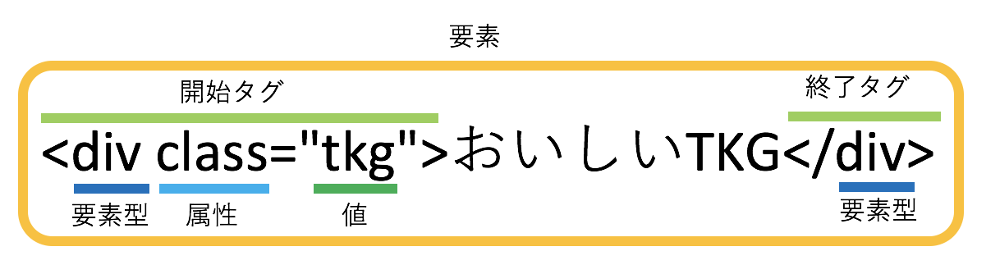

# 学習するにあたって
３章〜６章のサンプルコードの実行には, CodePenの利用をオススメする.  
CodePenは, 手軽にWebブラウザ上でHTMLやCSSで書かれたコードを実行することができるサービスである.  
https://codepen.io/ を開いて"Create a Pen"をクリックするとエディタが立ち上がる.

# HTMLの記述形式
HTMLは以下のような形式で記述される.  

```html
<要素型 属性="値">テキスト</要素型>
```

`<要素型>`や`</要素型>`の形式で記述されたものを**タグ**(HTMLタグ)と呼び, 特に, `<要素型>`を**開始タグ**, `</要素型>`を**終了タグ**と呼ぶ.  
**要素型**は文書に対して意味付けを行うための構成要素で, **属性**や**値**はさらにそれに対して付加的な設定を行うための構成要素である.  
要素型, 属性, 値に指定できるパラメータは実に様々な種類がある.  
属性や値の指定は必須ではないため, 省略できるケースもある.  
要素型, 属性, 値については次節以降で詳しく解説する.  
また, タグ・要素型・属性・値・テキストを全て合わせたものを**要素**と呼ぶ.



HTMLでリンクを生成する場合は以下のように記述する.

```html
<a href="example.com">移動する</a>
```

> 実行結果:  
> 

要素型によっては終了タグが無いものも存在する.

```html
<要素型 属性="値" />
```

終了タグがないものには画像の表示などがある.

```html

```

# 要素型
**要素型**は文書に対して意味付けを行うための構成要素である.  
非常に種類が多いため, ここでは主要なものに絞って紹介する.

|要素型|説明|
|:--|:--|
|`h1` 〜 `h6`|見出しであることを表現する|
|`p`|パラグラフ(段落)であることを表現する|
|`br`|改行を表現する|
|`hr`|横線を表現する|
|`ul`|番号の無いリストを表現する|
|`ol`|番号付きのリストを表現する|
|`a`|ハイパーリンクを表現する|
|`img`|画像を表示する|
|`input`|テキストボックスなどの様々なフォーム部品を表現する|
|`button`|ボタンを表現する|
|`table`|テーブル(表)を表現する|

# 属性と値
**属性**と**値**(**属性値**)は要素型に対してさらに付加的な設定を追加するための構成要素である.  
以下の例の場合, 属性は`class`となり, `class`属性と呼ばれる.  
値は`tkg`である.

```html
<div class="tkg">おいしいTKG</div>
```

属性はタグによって使用できるものが決められている.  
非常に種類が多いため, ここでは主要なものに絞って紹介する.

|属性|説明|使用できるタグ|
|:--|:--|:--|
|`id`|特定の要素へスタイルを設定するために指定する|すべて|
|`class`|特定の要素へスタイルを設定するために指定する|すべて|
|`href`|リンクされたソースのURL|`<a>`, `<link>`など|
|`src`|画像等の埋め込みコンテンツのURLを指定する|``, `<input>`など|
|`action`|フォーム経由で送信される情報を処理するURIを指定する|`<form>`|
|`method`|フォームを送信する際に使用するHTTPメソッドを定義する|`<form>`|
|`for`|この要素が属する要素を指定する id属性の値と紐づけられる|`<label>`, `<output>`|
|`type`|要素の型を定義する|`<button>`, `<input>`など|
|`name`|要素の名前 送信されたフォームでサーバーがフィールドを識別するために使用|`<input>`, `<select>`など|
|`value`|ページ読み込み時に要素で表示するデフォルト値を定義する|`<option>`, `<input>`など|
|`disabled`|閲覧者によるコントロールの操作を無効にするかどうかを示す|`<button>`, `<input>`など|
|`charset`|ページまたはスクリプトの文字エンコーディングを宣言する|`<meta>`, `<script>`|

`id`属性と`class`属性の違いは, 属性値が一意かどうかである.  
`id`属性の値は同一ファイル内で一意(ユニーク)に指定する必要があるが, `class`属性の値は同一ファイル内で何度も同じ値を使用することができる.

# コメント
**コメント**はコード中に注意書きを残したり, 構造や構成を分かりやすくするために記述され, Webブラウザ上に描画はされない.  
ただし, ソースコードを見るとコメントも表示されるため, パスワードなど秘密の情報は書かないようにする.  
コメントは以下の形式で記述する.

```html
<!-- これはコメントです -->
```

# HTMLの雛形
以下のコードがHTMLの最も基本的な構造である.

```html
<!DOCTYPE html>
<html lang="ja">
  <head>
    <meta charset="utf-8" />
    <title>タイトル</title>
  </head>
  <body>
    <!-- ここにコンテンツが入ります -->
  </body>
</html>
```

1行目:  
DOCTYPE宣言.  
次項で詳しく解説.

2行目:  
`html`タグはすべてのタグの親(ルート要素)にあたり, HTMLを記述する際は全て `<html>`タグ内に記述する.
また, `lang="ja"`と指定することで, このWebページの言語は日本語であるということを表現している.

3行目:  
`head`タグ内にはWebページのヘッダ情報を記述する.  
主に `meta`タグと`title`タグを記述したり, ファビコンやCSSといった外部ファイルの読み込みに使用される.

4行目:  
`meta`タグは検索エンジンやWebブラウザにWebページの情報を伝えるためのもので`charset="utf-8"`というのはこのWebページの文字エンコーディングがUTF-8であるということを表現している(基本的にはUTF-8を指定するようにする).

5行目:  
`title`タグはWebブラウザのタブに表示される文字列を指定するためのものである.

> 実行結果:  
> 

7行目:
`body`タグ内にはコンテンツを記述する.  
よって, ほとんどのコードはこの中に記述することになる.

# DOCTYPE宣言
**DOCTYPE宣言**とは, HTMLやXHTMLの文書の一番先頭に記述される文字列で,

- その文書がHTMLで記述されているということ
- HTMLのバージョンが何なのかということ
- その**DTD**(**Document Type Definition**)に従った記述をするということ

の３つを表している.

DTDとは, ざっくり言うとマークアップの構成要素や順序(親子関係), 指定可能な属性について定めた規則のことである.

DOCTYPE宣言の書き方はバージョンによってまちまちで, HTML 4.01やXHTMLでは複数種類があり, 記述も長かったが, HTML 5以降ではかなり簡潔に記述できるようになった.  
以下はHTML 5でのDOCTYPE宣言である.

```html
<!DOCTYPE html>
```

これ以外のDOCTYPE宣言が書かれているHTMLの勉強サイトは旧石器時代の化石なので基本的に参照しないようにすると良い.
