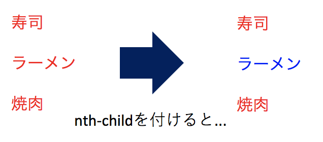

# CSSの記述形式
CSSは以下のような形式で記述される.

```css
セレクタ {
  プロパティ: 値
}
```

セレクタはHTMLのどの部分に対してデザインを適用するかの指定, プロパティはどのようなデザインを適用するのかの指定, 値はそのデザインがどのような度合いなのか(サイズや色など)の指定を行う.  

```html
<h1>TKGの作り方</h1>
```

```css
h1 {
  color: red;
}
```

> 実行結果:  
> 

次項以降では, セレクタ・プロパティ・値にそれぞれどんな種類があり, どんな働きをするのか, もう少し細かく見ていく.

# セレクタ
**セレクタ**とはHTMLのどの部分に対してデザインを適用させるかを指定するものである.  
主要なセレクタには以下のような種類がある.

```css
/* 全称セレクタ: 全ての要素に対してデザインを適用する */
* { ~ }

/* 要素型セレクタ: 指定した要素に対してデザインを適用する */
要素名 { ~ }

/* classセレクタ: 指定したclassを持つ要素に対してデザインを適用する */
.class名 { ~ }

/* idセレクタ: 指定したIDを持つ要素に対してデザインを適用する */
#id名 { ~ }

/* 属性セレクタ: 指定した属性を持つ要素に対してデザインを適用する */
要素名[属性名] { ~ }

/* 属性セレクタ: 指定した属性と値を持つセレクタに対してデザインを適用する */
要素名[属性名="値"] { ~ }

/* 複数のセレクタ: 指定した複数のセレクタに対してデザインを適用する */
セレクタ1, セレクタ2 { ~ }

/* 子孫セレクタ: セレクタ1よりも下の階層にあるセレクタ2に対してデザインを適用する */
セレクタ1 セレクタ2 { ~ }

/* 子セレクタ: セレクタ1の直下に存在するセレクタ2に対してデザインを適用する */
セレクタ1 > セレクタ2 { ~ }

/* 隣接セレクタ: セレクタ1の直後に隣接しているセレクタ2に対してデザインを適用する */
セレクタ1 + セレクタ2 { ~ }
```

# プロパティと値
**プロパティ**とはどのようなデザインを適用するのかの指定するものである.  
また, **値**とはそのデザインがどのよ
うな度合いなのか(サイズや色など)の指定を行うものである.  

以下に頻繁に使用されるプロパティをまとめた.

|プロパティ名|説明|
|:--|:--|
|`width`|要素の幅を指定する|
|`height`|要素の高さを指定する|
|`padding`|要素の余白を指定する|
|`margin`|要素の余白を指定する|
|`border`|ボーダーの太さや色などを指定する|
|`color`|文字色を指定する|
|`font-size`|文字サイズを指定する|
|`text-align`|テキストやコンテンツの表示位置を指定する|
|`background-color`|背景色を指定する|
|`position`|ボックスの配置方法を指定する|

# 擬似要素と擬似クラス
**擬似要素**は要素の一部分に対してスタイルを指定することができる.  
記述方法はセレクタの後に`::`(コロン２つ)を付けて記述する.

以下に頻繁に使用される疑似要素をまとめた.

|疑似要素|説明|
|:--|:--|
|`::before`|要素のコンテンツの直前に内容を挿入する|
|`::after`|要素のコンテンツの直後に内容を挿入する|
|`::first-letter`|要素内の最初の文字に対してスタイルを適用する|
|`::first-line`|要素内の最初の行に対してスタイルを適用する|

ここでは`before`を例にサンプルコードを示す.

```html
<h1>TKGの作り方</h1>
```

```css
h1::before {
  content: 'おいしい';
}
```

> 実行結果:  
> 

**擬似クラス**は指定した要素全てにスタイルが影響される.  
文書構造の範囲外にある情報や単体セレクタで表現できないものを選択するために導入された.  
記述方法はセレクタの後に`:`(コロン)を付けて記述する.  

以下に頻繁に使用される疑似クラスをまとめた.

|擬似クラス|説明|
|:--|:--|
|`:hover`|カーソルが乗っている要素にスタイルを適用する|
|`:focus`|フォーカスされた要素にスタイルを適用する|
|`:nth-child(n)`|n番目の子要素にスタイルを適用する|
|`:nth-of-type(n)`|n番目のその種類の要素にスタイルを適用する|
|`:not(セレクタ)`|引数で指定するセレクタに当てはまらない要素に対してスタイルを適用する|

ここでは`nth-child`を例にサンプルコードを示す.

```html
<p>寿司</p>
<p>ラーメン</p>
<p>焼肉</p>
```

```css
p {
  color: red;
}

p:nth-child(2) {
  color: blue;
}
```

> 実行結果:  
> 

# CSSの記述例
CSSは以下の３種類の記述の仕方がある.
- CSSファイルに記述してHTMLから読み込む
- HTMLファイルの`style`タグ内に記述する
- HTMLのタグの`style`属性に記述する

CSSファイルに記述する場合は, 記述したCSSファイルをHTMLファイルの`head`タグ内で読み込む.  
読み込みには `link` タグを使用し, `rel`属性には`stylesheet`, `href`属性には読み込むファイルのパスを指定する.  
この方法が最も保守性が高いため, 大抵はこの方法でCSSを記述する.

```html
<head>
  <link rel="stylesheet" href="css/style.css" />
</head>
```

HTMLファイルの`style`タグ内に記述する場合は, `style`タグを`head`タグ直下に記述し, その中にCSSを記述する.

```html
<!-- 省略 -->
<head>
  <style>
    body {
      color: red;
    }
  </style>
</head>
<!-- 省略 -->
```

HTMLのタグの`style`属性に記述する場合は, 以下の様に記述する.

```html
<body style="color: red; background: blue;"></body>
```
