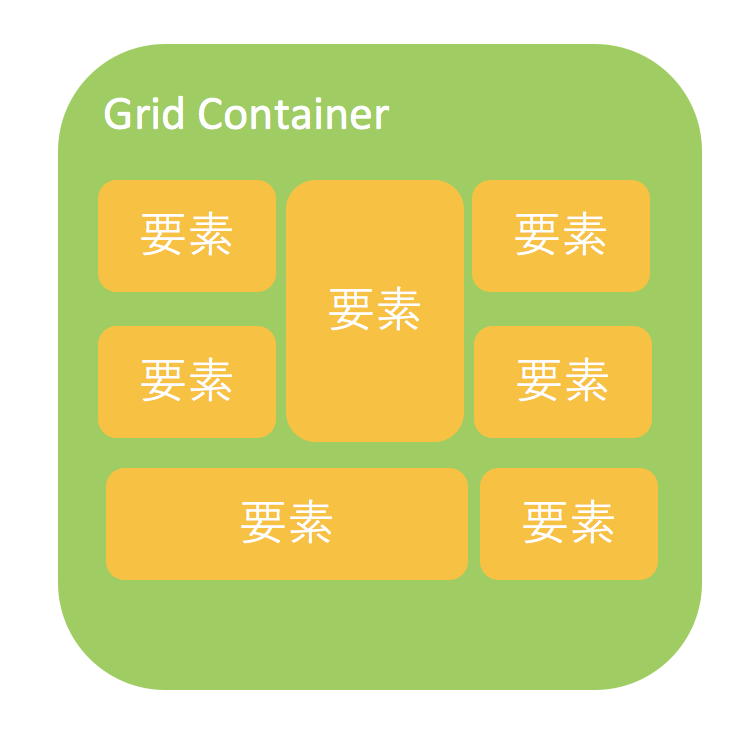
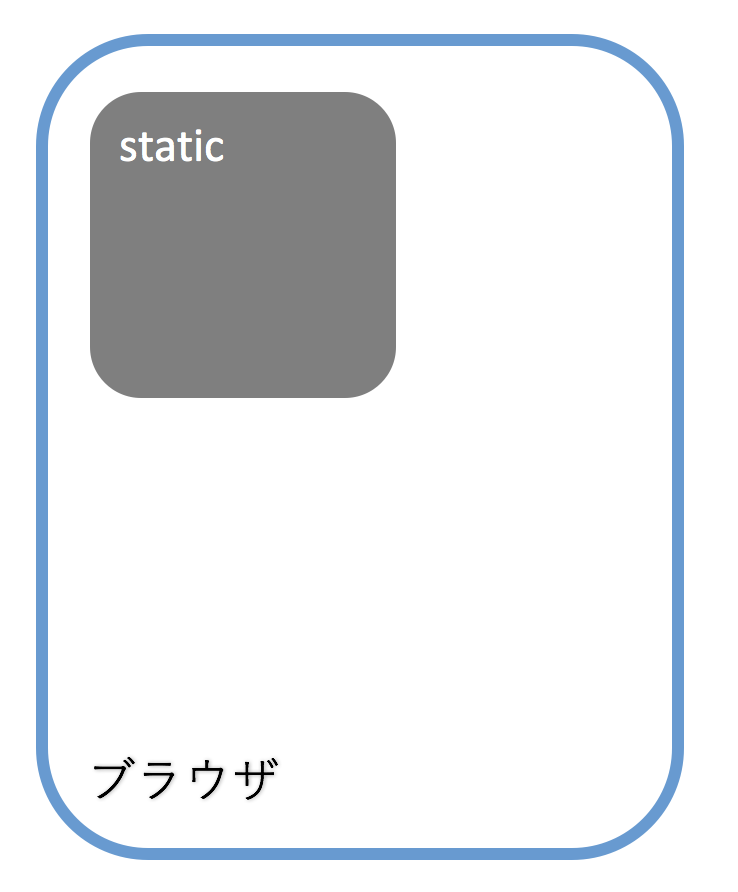
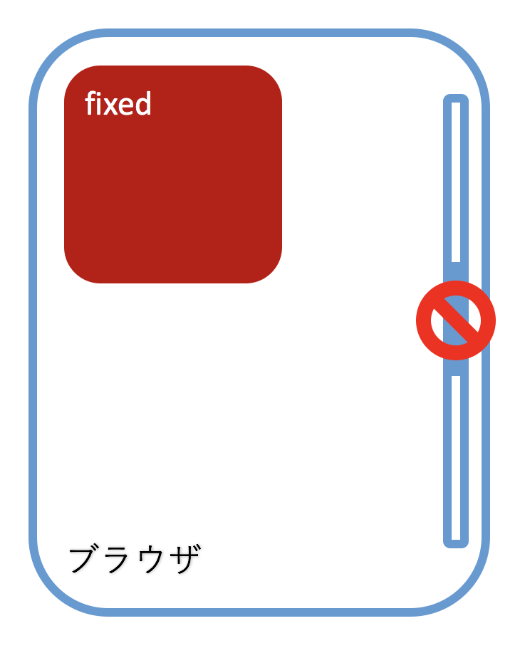
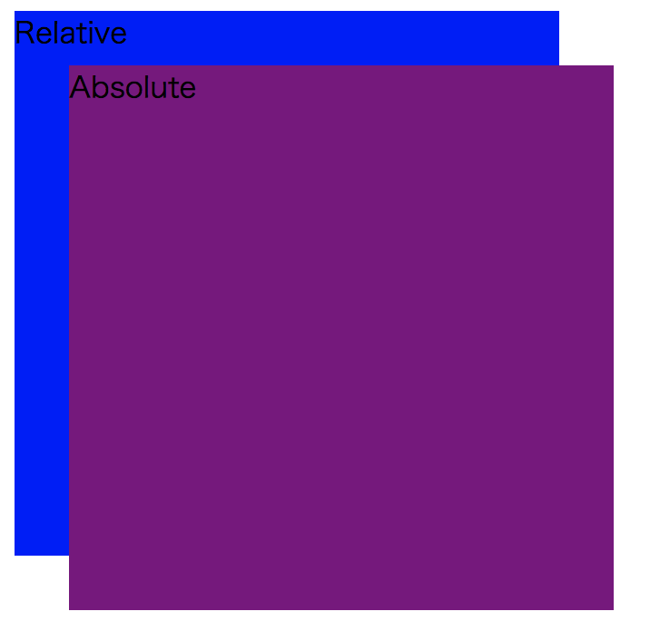

# 詳細度
CSSには**詳細度**(**Specificity**)と呼ばれる概念があり, 簡単に説明すると「スタイルが重複したときにどのスタイルを優先するか」を定量化したものである.  
定義したCSSが上手く適用されない場合は, 詳細度を疑うと良い.

詳細度はかなり複雑なため, 全て覚える必要は無いが, 一般的に適用範囲が広いセレクタほど優先度は低くなる.  
正確さには欠けるが, 以下に簡易的に詳細度をまとめた.  
上に行くほど詳細度が高い(つまり優先度が高い)ものとなっている.

- !important
- インライン記述(`style`属性に記述)
- idセレクタ
- 属性セレクタ・classセレクタ・擬似クラス
- 要素セレクタ・擬似要素
- 全称セレクタ

詳しい詳細度については, https://specifishity.com/ に分かりやすくまとめられている.

# ボックスモデル
HTMLの全ての要素は**ボックスモデル**に従って表現され, **ボックス**は２種類の余白(`margin`, `padding`), 境界線(`border`), 幅(`width`), 高さ(`height`), そしてその中に入っている要素で構成される.  
ボックスモデルを意識してCSSを書くことで, レイアウト崩れで悩むことは格段に減るだろう.


# ボックスの種類
前項で解説したボックスにはいくつか種類があり, 主なものには`block`, `inline`, `inline-block`, `flex`, `grid`, `none`がある.  
また, それぞれの要素は要素によって様々な初期値が設定されている.  

**displayプロパティ**はボックスの種類をCSSから操作するためのプロパティである.  
例えば, span要素は初期値として`inline`が設定されているが, displayプロパティで`inline-block`に変更している.

```css
span {
  display: inline-block;
}
```

次に, それぞれのボックスの特徴を以下に示す.

|ボックスの種類|説明|
|:--|:--|
|`block`|・要素が縦に並ぶ(改行が入る)<br>・widthとheightを設定できる<br>・上下左右のmarginとpaddingを設定できる<br>|
|`inline`|・要素が横に並ぶ<br>・widthとheightを設定できない(文字のサイズによって左右される)<br>・左右のmarginとpaddingを設定できる<br>|
|`inline-block`|・要素が横に並ぶ<br>・widthとheightを設定できる<br>・上下左右のmarginとpaddingを設定できる<br>|
|`flex`|親要素に`flex`を指定すると, 子要素が`block`であろうがなかろうが改行されずに横並びで表示される.<br>|
|`grid`|親要素に`grid`を指定すると, 要素をグリッド状に分割し, 子要素の幅と高さがグリッド何個分なのかを指定できる.<br>|
|`none`|要素を非表示にする.|

# positionプロパティ
**positionプロパティ**はボックスの配置方法(何を基準位置として配置するか)を指定するためのプロパティである.  
指定するのは配置方法のみのため, 実際の表示位置の指定には, top, bottom, left, rightといったプロパティを併用し, 基準位置からの距離を設定する必要がある.  
positionプロパティの値には, `static`, `relative`, `absolute`, `fixed`の４種類がある.

|値|説明|
|:--|:--|
|`static`|・全ての要素はこの初期値を持つ.<br>・top, bottom, left, rightプロパティを適用できない.<br>|
|`relative`|・相対位置への配置.<br>・基準位置は`static`を指定した場合に表示される位置と同様.<br>|
|`absolute`|・絶対位置への配置.<br>・基準位置は親要素が`static`を指定している場合, ブラウザの左上に位置する.<br>・親要素が`static`以外を指定している場合, 親要素の左上に位置する.<br>|
|`fixed`|絶対位置への配置.<br>`absolute`と同じ基準位置だが, スクロールしても位置が固定されたままとなる.<br>|

positionプロパティのサンプルコードを以下に示す.

```html
<div class="relative">
  Relative
  <div class="absolute">Absolute</div>
</div>
```

```css
.relative {
  width: 300px;
  height: 300px;
  background: blue;
  position: relative;
}

.absolute {
  width: 300px;
  height: 300px;
  background: purple;
  position: absolute;
  top: 30px;
  left: 30px;
}
```

> 実行結果:  
> 
