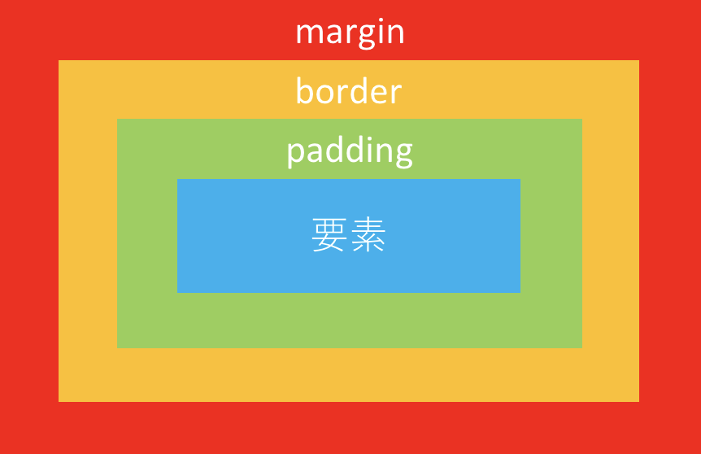

# 詳細度
CSSには**詳細度**(**Specificity**)と呼ばれる概念があり, 簡単に説明すると「スタイルが重複したときにどのスタイルを優先するか」を定量化したものである.  
定義したCSSが上手く適用されない場合は, 詳細度を疑うと良い.

詳細度はかなり複雑なため, 全て覚える必要は無いが, 一般的に適用範囲が広いセレクタほど優先度は低くなる.  
正確さには欠けるが, 以下に簡易的に詳細度をまとめた.  
上に行くほど詳細度が高い(つまり優先度が高い)ものとなっている.

- !important
- インライン記述(`style`属性に記述)
- idセレクタ
- 属性セレクタ・classセレクタ・擬似クラス
- 要素セレクタ・擬似要素
- 全称セレクタ

詳しい詳細度については, https://specifishity.com/ に分かりやすくまとめられている.

# ボックスモデル
HTMLの全ての要素は**ボックスモデル**に従って表現され, **ボックス**は２種類の余白(`margin`, `padding`), 境界線(`border`), 幅(`width`), 高さ(`height`), そしてその中に入っている要素で構成される.  
ボックスモデルを意識してCSSを書くことで, レイアウト崩れで悩むことは格段に減るだろう.



# ボックスの種類
前項で解説したボックスにはいくつか種類があり, 主なものには`block`, `inline`, `inline-block`, `flex`, `grid`がある.  
また, それぞれの要素は要素によって様々な初期値が設定されている.  

**displayプロパティ**はボックスの種類をCSSから操作するためのプロパティである.  
例えば, span要素は初期値として`block`が設定されているが, displayプロパティで`inline-block`に変更している.

```css
span {
  display: inline-block;
}
```

次に, それぞれのボックスの特徴を以下に示す.

|ボックスの種類|説明|
|:--|:--|
|`block`|見出し, 段落, リスト, フォーム等のひとつのまとまった単位として表す.<br>親要素の幅全体に広がって配置される.<br>親要素が`inline`, `inline-block`の場合, 子要素の値を`block`にすることはできない.|
|`inline`|主に文章の一部分として利用する. 文字列の幅やフォントサイズが`width`と`height`の大きさになる. `width`, `height`, `margin-top`, `margin-bottom`は指定できない.|
|`inline-block`|`inline`とほとんど同じ用途で使用されるが, `inline-block`の場合, `width`, `height`, `margin-top`, `margin-bottom`も指定できる.|
|`flex`|CSS3から追加された表示形式. 親要素に`flex`を指定すると, 子要素が`block`であろうが, 子要素は改行されずに横並びで表示される.|
|`grid`|子要素をグリッドレイアウト(要素を格子状に並べるレイアウト)によって列と行に整列する. `grid`要素内で列と行の数を定義する.|

# positionプロパティ
positionプロパティはボックスの配置方法（基準位置）を指定するために使用する.  
指定するのは配置方法（基準位置）のみのため, 実際の表示位置の指定には, top, bottom, left, rightプロパティを併用して, 基準位置からの距離を設定する必要がある.  
positionプロパティの値には, `static`, `relative`, `absolute`, `fixed`の4種類がある.

|値|説明|
|:--|:--|
|`static`|初期値.<br>top, bottom, left, rightプロパティは適用されない.|
|`relative`|相対位置への配置.<br>基準位置は, `static`を指定した場合に表示される位置と同じ.|
|`absolute`|絶対位置への配置.<br>基準位置は, 親要素が`static`を指定している場合, ブラウザの左上に位置する.<br>親要素が`static`以外を指定している場合, 親要素の左上に位置する.|
|`fixed`|絶対位置への配置.<br>`absolute`と同じ基準位置だが, スクロールしても位置が固定されたままとなる.|

下記のコードはpositionプロパティの使用例である.

```html
<div class="relative">
  <div class="absolute">親要素の左上</div>
</div>
```

```css
.relative {
  position: relative;
}

.absolute {
  position: absolute;
  top: 10px;
  left: 10px;
}
```

// TODO: 画像追加

// TODO: ここから↓を別の章に持っていく(題意から外れているので)

# レスポンシブ対応
一昔前までは, WebページはPCに対応しておけば問題が無かった.  
しかし現在では, PCの他にもタブレットやスマートフォンなど, 様々なサイズ, 操作性を持ったデバイスが登場している.  
したがって, Webページも様々なデバイスで閲覧されるということである.  
そのため, どのデバイスで閲覧してもレイアウトが崩れずに表示され, それぞれのデバイスに合った操作性を提供することが必要になる.  
それを実現するのがレスポンシブ対応と言われるものである.  

レスポンシブ対応を行うには, HTMLとCSSの両方で設定する必要がある.

まず, HTMLでは`meta`タグに**viewport**の設定を行う.  
詳細は本書のレベルを超えるため説明を省くが, 簡単に説明するとviewportを設定することでスマートフォンなどの携帯型デバイスにも合った表示領域を設定することができる.  
これが上手く設定されていない場合, スマートフォンで閲覧してもPC版の表示がされてしまうことがある.

設定は以下のように行う.  
まず, `meta`タグの`name`属性に`viewport`と値を入れることでviewportの情報を定義する.  
次に, `content`属性には`width=device-width`と`initial-scale=1`を指定する.
`width=device-width`を設定することでデバイスごとにviewportの幅が自動で設定され, `initial-scale=1`を設定することで幅を等倍で表示する(IE以外では基本的にこれがデフォルト値なのだが, IEが生きている限りこの設定を書いておいた方が良いだろう).

```html
<!-- 省略 -->
<head>
  <meta name="viewport" content="width=device-width,initial-scale=1">
</head>
<!-- 省略 -->
```

次に, CSSでは**メディアクエリ**を設定する.  
メディアクエリとは, CSS3で追加された仕様の1つで, ブラウザの画面サイズに応じて適用するスタイルを切り替える機能である.  
メディアクエリの指定方法には大きく分けて３種類存在する.

- `link`タグ内で指定するパターン

```html
<link rel="stylesheet" href="style.css" media="screen and (max-width: 767px)">
```

- `@import`でCSSファイルを読み込む際に指定するパターン

```css
@import url("style.css") screen and (max-width: 767px);
```

- `@media`で指定するパターン  
このパターンが最も用いられる

```css
@media (max-width: 767px) {
  /* 省略 */
}
```

これらのコードは`width`が767px以下のブラウザに対してスタイルが適用される.  
また, `min-width: 768px`と定義すると, `width`が768px以上のブラウザに対してスタイルが適用される.

# CSS設計
CSSは思っているよりも破綻しやすい.  
そのため, ある程度CSSが複雑になることが予想されるのであれば, 初めのうちからCSS設計を導入することをお勧めする.  
CSS設計とは, class名の付け方やCSSファイルの分類に一定のルールを設けることで, 破綻しにくい堅牢なCSSを書くことができる仕組みの総称である.
CSS設計にも様々な種類があり, 導入の際にはそのプロジェクトに合ったCSS設計を採用すると良い.  
以下はCSS設計の例である.

|設計パターン|説明|
|:--|:--|
|OOCSS||
|SMACSS||
|BEM||
|MCSS||
|FLOCSS||
