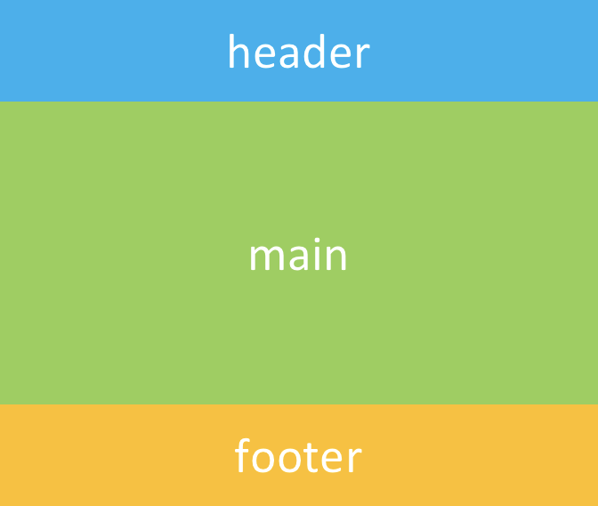
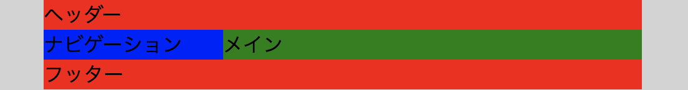

# Webサイトの構成

よく見かけるWebサイトは, タイトルなどを書いておく**ヘッダー**, そのWebサイトが提供する情報を置く**コンテンツ**, コピーライトなどを書いておく**フッター**の３つの部分から構成されていることが多い.  
これらの構成要素をHTML 5で記述する場合, それぞれ`header`, `main`, `footer`といったタグを用いる.



さらにコンテンツを置く`main`の中身は ひとまとまりの記事を表す`article`, さらにそれぞれの節を表す`section`に分割できる.  
また, メインコンテンツではない補足的な情報の場合は`aside`タグで記述する.  
また, Webサイトのメニューは`nav`タグで記述する.

// TODO: 画像追加

ちなみに, HTML 5以前は`header`, `main`, `footer`, `article`, `section`, `aside`, `nav`といったタグが用意されていなかったため, `div`タグに`id`や`class`を指定することで表現していた.

ここまでの話をまとめて作成したWebサイトの雛形を以下に示す.

```html
<body>
  <header>
    ヘッダー
    <nav>メニュー</nav>
  </header>
  <main>
    <article>
      <section>
        <h1>見出し</h1>
        <p>本文</p>
        <aside>補足情報</aside>
      </section>
    </article>
    <aside>余談</aside>
  </main>
  <footer>フッター</footer>
</body>
```

// TODO: 実行結果のスクショ

# WrapperとContainer
ディスプレイのサイズによって左右の余白を使い分ける必要がある.  
例えばディスプレイの横幅が広ければ左右に余白を入れないと読みにくくなるし, 逆にスマートフォンのようにディスプレイが小さいと左右に余白がありすぎるとコンテンツの表示領域が極端に狭まってしまう.  
こういった左右の余白を制御するための概念がWrapperとContainerである.  
WrapperはWebサイト全体に影響を及ぼすクラスとして使用し, Containerは各コンテンツごとに共通のクラスとして使用する.


以下はWrapperとContainerを使用した例である.  
分かりやすいように背景色を付けて表示する.

```html
<body>
  <div class="wrapper">
    <header>
      ヘッダー
    </header>
    <div class="container">
      <nav>
        ナビゲーション
      </nav>
      <main>
        メイン
      </main>
    </div>
    <footer>
      フッター
    </footer>
  </div>
</body>
```

```css
body {
  background: lightgray;
}

.wrapper {
  max-width: 480px;
  margin: 0 auto;
  background: red;
}

header footer {
  background: orange;
}

.container {
  display: flex;
}

nav {
  width: 30%;
  background: blue;
}

main {
  width: 70%;
  background: green;
}
```
> 実行結果:  
> 
