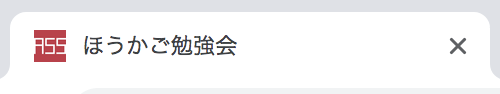
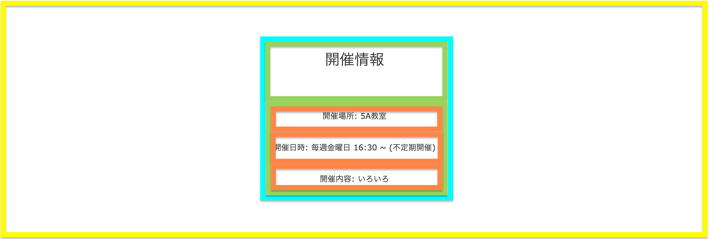

# Webサイトの作成
この章では実際に小さなWebサイトを作成し, より実践的な手法について学んでいく.  
完成品は https://after-school-study-group.github.io/html-css-study/src/index.html を参照.

# 素材の入手
作成に先立って, 今回作成するWebサイトに必要な素材(画像, テキスト)をダウンロードする.  
https://github.com/after-school-study-group/html-css-study-parts にアクセスし, Download Zipを押すとZipファイルがダウンロードされるため, 各自のPCで展開しておく.


# ファイルとディレクトリの作成
まずは必要なファイルとディレクトリを作成する.
構成は以下の通りである.

```
my-site
  index.html
  favicon.ico
  css
    style.css
  images
    ass.png
    takashi1.jpg
    takashi2.jpg
    takashi3.jpg
```

なお, `favicon.ico`と`images`ディレクトリ以下の画像は前項でダウンロードした素材の中に入っている.

まず初めにPC版を作成し, その後レスポンシブ対応のためのコードを追加していく.  
レスポンシブ対応については, 次章で詳しく紹介している.

## ヘッダ情報の記述
まず初めに, ヘッダ情報を記述する.

```html
<!DOCTYPE html>
<html lang="ja">
  <head>
    <meta charset="UTF-8">
    <link rel="stylesheet" href="css/style.css">
    <link rel="icon" href="favicon.ico">
    <title>ほうかご勉強会</title>
  </head>
  <body></body>
</html>
```

5行目:  
カレントディレクトリ内のcssフォルダ内の`style.css`というCSSファイルを読み込んでいる.

6行目:
カレントディレクトリ内の`favicon.ico`というファビコンを読み込んでいる.

## リセットCSSの作成
次にリセットCSSを作成する.  
リセットCSSとは, ブラウザによって異なるデフォルト値のCSSを打ち消し, ブラウザ間の表示を揃えるためのCSSファイルのことである.  
有名なリセットCSSには[Eric Meyer’s “Reset CSS” 2.0](https://cssreset.com/scripts/eric-meyer-reset-css/)や[Normalize.css](https://necolas.github.io/normalize.css/)がある.  
今回は簡易的なリセットCSSを作成する.

```css
body {
  font-size: 16px;
  font-family: Verdana, sans-serif;
  color: #333;
  margin: 0;
  padding: 0;
  box-sizing: border-box;
}

ul {
  list-style-type: none;
  padding: 0;
}
```

3行目:  
font-familyプロパティは, フォントのデザインを設定している.  
`Verdana`はMicrosoftが開発したサンセリフ体のフォントである.  
`sans-serif`は総称ファミリーと言い, 指定したフォントが使用できない閲覧者に, 最低限のフォントファミリーを提供するためのものである.  
今回は`sans-serif`を設定したので, ゴシック系のフォントを表示する.

7行目:  
box-sizingプロパティは, paddingとborderの幅と高さをwidthに含めるかどうかを設定する.  
`border-box`を指定することで, paddingとborderの幅と高さをwidthに含める設定にしている.

11行目:  
list-style-typeプロパティは, リストの項目の先頭に表示するマーカー文字の種類を示す.  
`none`を指定することで, マーカー文字を表示しないように設定している.

## コンテンツの作成
次に完成品を元に, コンテンツを作成する.  
コンテンツを作成する前に, CSSを記述する.  
今回はCSS設計のOOCSSを元にCSSを記述する.  
まず, Containerを作成する.  
Wrapperを指定すると背景色のレイアウトが崩れるため, 今回は使用しない.  
項目を横に並べるために`grid`も定義する.  
また, 共通で使用するクラスについても定義する.

```css
.container {
  padding: 0 20px;
  box-sizing: border-box;
  max-width: 768px;
  margin: 0 auto;
  color: chocolate;
}

.grid {
  display: grid;
  grid-template-columns: 50% 50%;
}

.image {
  width: 250px;
  height: 250px;
}
```  

4行目:  
`margin: 0 auto;` を指定することで, 要素を中央に寄せている.

11行目:  
grid-template-columnsプロパティを使用することで列の数を定義できる.  
今回は２つの列を`width: 50%;`で定義している.  
ここでは定義していないが, grid-template-rowsプロパティで行数を定義できる.

## ヘッダーの作成
まずはヘッダーから作成する.  
以下の画像のように, 要素ごとのまとまりを作成すると, HTML文が記述しやすくなる.



```html
<header>
  <div class="container">
    <div class="grid">
      <div class="col header-col">
        <p class="text-white">放課後に勉強して、圧倒的成長。</p>
        <h1 class="title text-white">ほうかご勉強会</h1>
        <a href="#" class="link">入会はこちらから</a>
      </div>
      <div class="col header-col">
        
      </div>
    </div>
  </div>
</header>
```

```css
header {
  background: #af384d;
  padding: 100px 0;
}

.text-white {
  color: white;
}

.title {
  font-size: 34px;
  margin-bottom: 50px;
  font-weight: normal;
}

.link {
  display: inline-block;
  padding: 10px 40px;
  background: #fff;
  text-align: center;
  color: #b81a3e;
  border-radius: 5px;
  text-decoration: none;
  opacity: 1;
}

.link:hover {
  opacity: 0.7;
}

.shadow {
  box-shadow: 0 0 10px 5px rgba(0, 0, 0, 0.3);
}

.header-col:last-of-type {
  padding: 10px;
  text-align: right;
  box-sizing: border-box;
}
```

13行目: 
font-weightプロパティを指定すると, 文字の太さを定義できる.  
ここでは`normal`を指定しているため, 文字の太さは等倍である.

// TODO: コード解説

## メインの作成
次にメイン画面を作成する.  
メイン画面は３つのarticle要素で構成されている.  
また, ２つ目のarticle要素の背景色はグレーになっている.  
それを踏まえ, 以下のような共通レイアウトを記述する.

```html
<main>
  <article>
    <section class="overview">
      <div class="container">
        <h2 class="sub-title">開催情報</h2>
      </div>
    </section>
  </article>
  <article>
    <section class="voices">
      <div class="container">
        <h2 class="sub-title">入会者の声</h2>
      </div>
    </section>
  </article>
  <article>
    <section class="notice">
      <div class="container">
        <h2 class="sub-title">お知らせ</h2>
      </div>
    </section>
  </article>
</main>
```

```css
article {
  padding: 100px 0;
  background: #fff;
}

article:nth-of-type(2n) {
  background: #f8f8f8;
}

.sub-title {
  text-align: center;
  margin-top: 0;
  margin-bottom: 80px;
  font-size: 30px;
  font-weight: normal;
}
```

6行目:  
`article:nth-of-type(2n)`は, articleプロパティの偶数番目のものにスタイルを適用する.

10行目:  
`sub-title`という共有のclassセレクタを作成することで, レイアウトを統一し, コード量を削減している.

### 開催情報・お知らせの作成
これら２つの項目は, 同じ構成をしているため, まとめてに解説する.  
以下の画像は開催情報・お知らせの要素ごとのまとまりを表している.




```html
<article>
  <section class="overview">
    <div class="container">
      <h2 class="sub-title">開催情報</h2>
      <ul class="lists">
        <li class="list">開催場所: 5A教室</li>
        <li class="list">開催日時: 毎週金曜日 16:30 ~ (不定期開催)</li>
        <li class="list">開催内容: いろいろ</li>
      </ul>
    </div>
  </section>
</article>
<article>
  <!-- 省略 -->
</article>
<article>
  <section class="notice">
    <div class="container">
      <h2 class="sub-title">お知らせ</h2>
      <ul class="lists">
        <li class="list">2019/07/12 PHP勉強会</li>
        <li class="list">2019/07/05 JS勉強会</li>
        <li class="list">2019/06/14 HTML/CSS勉強会</li>
        <li class="list">2019/06/07 Git/GitHub勉強会</li>
      </ul>
    </div>
  </section>
</article>
```

```css
.lists {
  text-align: center;
}

.list {
  margin-bottom: 40px;
}

.lists .list:last-of-type {
  margin-bottom: 0;
}
```

9行目:  
擬似クラスの`:last-of-type`を使用することで, 指定されたセレクタの最後の要素にスタイルが適用される.

### 入会者の声の作成

### フッターの作成
フッターは簡単に作成できるため, 解説は省略する.

```html
<footer>
  <div class="container">
    <p>Copyright 2019 ほうかご勉強会</p>
  </div>
</footer>
```

```css
footer {
  padding: 100px 0;
  text-align: center;
  color: #fff;
  background: linear-gradient(to right, #af384d, #b81a3e);
}
```

## レスポンシブ対応
