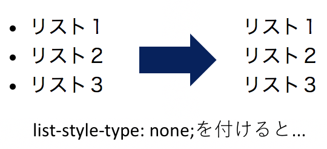

# Webサイトの作成
この章では実際に小さなWebサイトを作成し, より実践的な手法について学んでいく.  
完成品は https://after-school-study-group.github.io/html-css-study/src/index.html を参照.

# 素材の入手
作成に先立って, 今回作成するWebサイトに必要な素材(画像, テキスト)をダウンロードする.  
https://github.com/after-school-study-group/html-css-study-parts にアクセスし, "Download Zip"を押すとZipファイルがダウンロードされるため, 各自のPCで展開しておく.


# ファイルとディレクトリの作成
まずは必要なファイルとディレクトリを作成する.  
構成は以下の通りである.

```
my-site
├ index.html
├ favicon.ico
├ css
│ └ style.css
└ images
　 ├ ass.png
　 ├ takashi1.jpg
　 ├ takashi2.jpg
　 └ takashi3.jpg
```

HTMLは`index.html`, CSSは`style.css`に記述していく.  
なお, `favicon.ico`と`images`ディレクトリ以下の画像は前項でダウンロードした素材の中に入っている.

# 進め方
まず初めにPC版のレイアウトを作成し, その後スマートフォンなどにも対応できるようコードを追加していく.  

# HTMLの雛形の作成
まず初めに, HTMLの雛形を作成する.  
HTMLの雛形の書き方については, [第３章 HTMLの基礎知識 > HTMLの雛形](./03_html_basic_knowledge.md)で既に詳しく解説した.

```html
<!DOCTYPE html>
<html lang="ja">
  <head>
    <meta charset="utf-8">
    <link rel="stylesheet" href="css/style.css">
    <link rel="icon" href="favicon.ico">
    <title>ほうかご勉強会</title>
  </head>
  <body>
    <!-- ここにコンテンツが入ります -->
  </body>
</html>
```

5行目:  
カレントディレクトリにあるcssディレクトリ内の`style.css`という名前のCSSファイルを読み込んでいる.

6行目:  
カレントディレクトリ内の`favicon.ico`というファビコンを読み込んでいる.  
ファビコンとは, Webブラウザのタブに表示される画像のことである.


# リセットCSSの作成
たとえCSSを一行も書かなくても, Webブラウザによってデフォルトのスタイルが適用される.  
このデフォルトのスタイルによって思わぬレイアウト崩れやWebブラウザごとの差異が起こることがあるので, **リセットCSS**と呼ばれるCSSファイルを読み込んで, デフォルトのスタイルを打ち消しておく.

有名なリセットCSSには,

- [Eric Meyer’s “Reset CSS” 2.0](https://cssreset.com/scripts/eric-meyer-reset-css/)
- [Normalize.css](https://necolas.github.io/normalize.css/)

などがある.

今回は簡易的なリセットCSSを自分で作成することで対応する.

```css
body {
  font-size: 16px;
  font-family: Verdana, sans-serif;
  color: #333;
  margin: 0;
  padding: 0;
  box-sizing: border-box;
}

ul {
  list-style-type: none;
  padding: 0;
}
```

3行目:  
font-familyプロパティは, フォントを設定するプロパティである.  
複数指定した場合, 左側がはじめに適用され, もしもそのWebブラウザがそのフォントに対応していなかった場合は右側が適用される.  
`Verdana`はサンセリフ体のフォントで, `sans-serif`はゴシック体のフォント(詳しくは総称ファミリーで調べてほしい)である.

7行目:  
box-sizingプロパティは, paddingとborderの幅と高さをwidthに含めるかどうかを設定する.  
`border-box`を指定することで, paddingとborderの幅と高さをwidthに含める設定にしている.  
詳しくは, [第８章 発展的なトピック > box-sizing](./08_evolving_topic.md)を参照.

11行目:  
list-style-typeプロパティは, リストの項目の先頭に表示するマーカー文字の種類を示す.  
`none`を指定することで, マーカー文字を表示しないように設定している.  
以下に例を表示する.

```html
<ul>
  <li>
    リスト１
  </li>
  <li>
    リスト２
  </li>
  <li>
    リスト３
  </li>
</ul>
```

```css
ul {
  list-style-type: none;
}
```

> 実行結果:  
> 

# メインコンテンツの作成
ここからはメインコンテンツを作成する.  
今回は, CSSの記述に, **OOCSS**と呼ばれる設計手法を用いる.  
CSS設計を用いることで, 堅牢で破綻しにくいCSSを記述することが可能になる.  
CSS設計の詳細については, [第８章 発展的なトピック > CSS設計](./08_evolving_topic.md)を参照してほしい.

まずはContainerを作成する.  
今回はWrapperを指定すると背景色のレイアウトが崩れるため使用しない.  
項目を横に並べるために`grid`も定義する.  
また, 共通で使用するクラスについても定義する.

```css
.container {
  padding: 0 20px;
  box-sizing: border-box;
  max-width: 768px;
  margin: 0 auto;
}

.grid {
  display: grid;
  grid-template-columns: 50% 50%;
}

.image {
  width: 250px;
  height: 250px;
}
```  

4行目:  
`margin: 0 auto;`を指定することで, 要素を中央に揃えることができる.

11行目:  
grid-template-columnsプロパティを使用することで列の数を定義できる.  
今回は２つの列を`width: 50%;`で定義している.  
ここでは定義していないが, grid-template-rowsプロパティで行数を定義できる.

# ヘッダーの作成
まずはヘッダーから作成する.  
以下の画像のように, 要素ごとのまとまりを作成すると, HTML文が記述しやすくなる.


```html
<header>
  <div class="container">
    <div class="grid">
      <div class="col header-col">
        <p class="text-white">放課後に勉強して、圧倒的成長。</p>
        <h1 class="title text-white">ほうかご勉強会</h1>
        <a href="#" class="link">入会はこちらから</a>
      </div>
      <div class="col header-col">
        
      </div>
    </div>
  </div>
</header>
```

```css
header {
  background: #af384d;
  padding: 100px 0;
}

.text-white {
  color: white;
}

.title {
  font-size: 34px;
  margin-bottom: 50px;
  font-weight: normal;
}

.link {
  display: inline-block;
  padding: 10px 40px;
  background: #fff;
  text-align: center;
  color: #b81a3e;
  border-radius: 5px;
  text-decoration: none;
  opacity: 1;
}

.link:hover {
  opacity: 0.7;
}

.shadow {
  box-shadow: 0 0 10px 5px rgba(0, 0, 0, 0.3);
}

.header-col:last-of-type {
  padding: 10px;
  text-align: right;
  box-sizing: border-box;
}
```

13行目:  
font-weightプロパティを指定すると, 文字の太さを定義することができる.  
ここでは`normal`を指定しているため, 文字の太さは等倍である.

22行目:  
border-radiusプロパティを指定することで要素の角を丸めることができる.  
widthとheightが同じ大きさなら`50%`にすると

23行目:  
text-decorationプロパティはテキスト傍線の付け方, 色, スタイルを定義することができる.  
ここでは`none`を指定しているため, テキスト傍線は表示されない.

24行目:  
opacityプロパティは要素の透明度を定義することができる.  
値としては, 1.0が不透明で0.0になるにつれて薄くなり, 0.0で透明になる.

27行目:  
擬似クラスの`:hover`を使用することで, カーソルが要素の上にきたときにスタイルを適用する.

32行目:  
box-shadowプロパティは要素に影を付けるために使用される.
ここでは`0 0 10px 5px`と指定し, ぼかしの距離10pxにし, 影を5pxで定義している.  
`rgba(0, 0, 0, 0.3)`はrgbの値を指定し, 4つ目の値で透明度を定義している.

35行目:  
擬似クラスの`:last-of-type`を使用することで, 指定されたセレクタの最後の要素にスタイルが適用される.

# メインの作成
次にメイン画面を作成する.  
メイン画面は３つのarticle要素で構成されている.  
また, ２つ目のarticle要素の背景色はグレーになっている.  
それを踏まえ, 以下のような共通レイアウトを記述する.

```html
<main>
  <article>
    <section class="overview">
      <div class="container">
        <h2 class="sub-title">開催情報</h2>
      </div>
    </section>
  </article>
  <article>
    <section class="voices">
      <div class="container">
        <h2 class="sub-title">入会者の声</h2>
      </div>
    </section>
  </article>
  <article>
    <section class="notice">
      <div class="container">
        <h2 class="sub-title">お知らせ</h2>
      </div>
    </section>
  </article>
</main>
```

```css
article {
  padding: 100px 0;
  background: #fff;
}

article:nth-of-type(2n) {
  background: #f8f8f8;
}

.sub-title {
  text-align: center;
  margin-top: 0;
  margin-bottom: 80px;
  font-size: 30px;
  font-weight: normal;
}
```

6行目:  
`article:nth-of-type(2n)`は, articleプロパティの偶数番目のものにスタイルを適用する.

10行目:  
`sub-title`という共有のclassセレクタを作成することで, レイアウトを統一し, コード量を削減している.

# 「開催情報」・「お知らせ」の作成
以下の画像は開催情報・お知らせの要素ごとのまとまりを表している.


```html
<article>
  <section class="overview">
    <div class="container">
      <h2 class="sub-title">開催情報</h2>
      <ul class="lists">
        <li class="list">開催場所: 5A教室</li>
        <li class="list">開催日時: 毎週金曜日 16:30 ~ (不定期開催)</li>
        <li class="list">開催内容: いろいろ</li>
      </ul>
    </div>
  </section>
</article>
<article>
  <!-- 省略 -->
</article>
<article>
  <section class="notice">
    <div class="container">
      <h2 class="sub-title">お知らせ</h2>
      <ul class="lists">
        <li class="list">2019/07/19 PHP勉強会</li>
        <li class="list">2019/07/05 JS勉強会</li>
        <li class="list">2019/06/14 HTML/CSS勉強会</li>
        <li class="list">2019/06/07 Git/GitHub勉強会</li>
      </ul>
    </div>
  </section>
</article>
```

```css
.lists {
  text-align: center;
}

.list {
  margin-bottom: 40px;
}

.lists .list:last-of-type {
  margin-bottom: 0;
}
```

# 「入会者のこえ」の作成
最後に入会者の声の項目を作成する.  


```html
<main>
  <article>
    <!-- 省略 -->
  </article>
  <article>
    <section class="voices">
      <div class="container">
        <h2 class="sub-title">入会者のこえ</h2>
        <div class="grid voices-grid">
          <div class="col voices-col">
            
          </div>
          <div class="col voices-col">
            <h3>ひで</h3>
            <p>超超超いい感じ超超超超いい感じ超超超いい感じ超超超超いい感じ超超超いい感じ超超超超いい感じ超超超いい感じ超超超超いい感じ超超超いい感じ超超超超いい感じ超超超いい感じ超超超超いい感じ超超超いい感じ超超超超いい感じ超超超いい感じ超超超超いい感じ超超超いい感じ超超超超いい感じ</p>
          </div>
        </div>
        <div class="grid voices-grid">
          <div class="col voices-col">
            
          </div>
          <div class="col voices-col">
            <h3>いぬ</h3>
            <p>木曜日は （モクモク） 僕にまかせて！ （モクモク） いいものいっぱい （モクモク） 木曜モッくん 木曜の市 朝と夕方 僕に 会いに来て！ モクモク モッくん 木曜モッくん メガホン持って あなたを応援！！ モクモク モッくん 木曜モッくん 木曜日は 僕に 会いに来て～</p>
          </div>
        </div>
        <div class="grid voices-grid">
          <div class="col voices-col">
            
          </div>
          <div class="col voices-col">
            <h3>たかし</h3>
            <p>あ～～アツい！！アツいアツいアツい！！！！！あつすぎる～～～～～～、うわあああああああ！！！！！あぢ～～～～～～～～！！！！！あついっピーーーーーーーーー！！！！！！！！！！！！</p>
          </div>
        </div>
      </div>
    </section>
  </article>
  <article>
    <!-- 省略 -->
  </article>
</main>
```

```css
.voices-grid {
  margin-bottom: 40px;
}

.voices-grid:last-of-type {
  margin-bottom: 0;
}

.voices-grid:nth-of-type(2n) .voices-col:first-of-type {
  text-align: right;
}

.voices-grid:nth-of-type(2n) .voices-col:last-of-type {
  grid-row-start: 1;
}

.circle {
  border-radius: 50%;
}
```

13, 14行目:  
grid-row-startプロパティはカラムの表示順序を入れ替えることができる.  
`.voices-col:last-of-type`に`1`を定義することで, 最後の要素が最初に表示されるようになる.

# フッターの作成
フッターは簡単に作成できるため, 解説は省略する.



```html
<footer>
  <div class="container">
    <p>Copyright 2019 ほうかご勉強会</p>
  </div>
</footer>
```

```css
footer {
  padding: 100px 0;
  text-align: center;
  color: #fff;
  background: linear-gradient(to right, #af384d, #b81a3e);
}
```

# レスポンシブ対応
最後にレスポンシブ対応をする.  
レスポンシブ対応については, [第８章 発展的なトピック > レスポンシブ対応](./08_evolving_topic.md)で詳しく紹介している.  

```html
<head>
  <meta charset="utf-8">
+ <meta name="viewport" content="width=device-width,initial-scale=1">
  <link rel="stylesheet" href="css/style.css">
  <link rel="icon" href="favicon.ico">
  <title>ほうかご勉強会</title>
</head>
```

```css
@media (max-width: 767px) {
  .container {
    width: 100%;
  }
}

@media (max-width: 767px) {
  .grid {
    grid-template-columns: 100%;
  }
}

@media (max-width: 767px) {
  .header-col {
    text-align: center;
  }
  .header-col:last-of-type {
    text-align: center;
    grid-row-start: 1;
  }
}

@media (max-width: 767px) {
  .voices-grid:nth-of-type(2n) .voices-col:first-of-type {
    text-align: center;
    grid-row-start: 1;
  }
  .voices-grid:nth-of-type(2n) .voices-col:last-of-type {
    grid-row-start: 2;
  }
  .voices-col {
    text-align: center;
  }
}
```

まず, head内にviewportを定義する.  
`@media (max-width: 767px)`内にスタイルを記述することで, ブラウザの幅が767px以下のときにスタイルが適用される.
