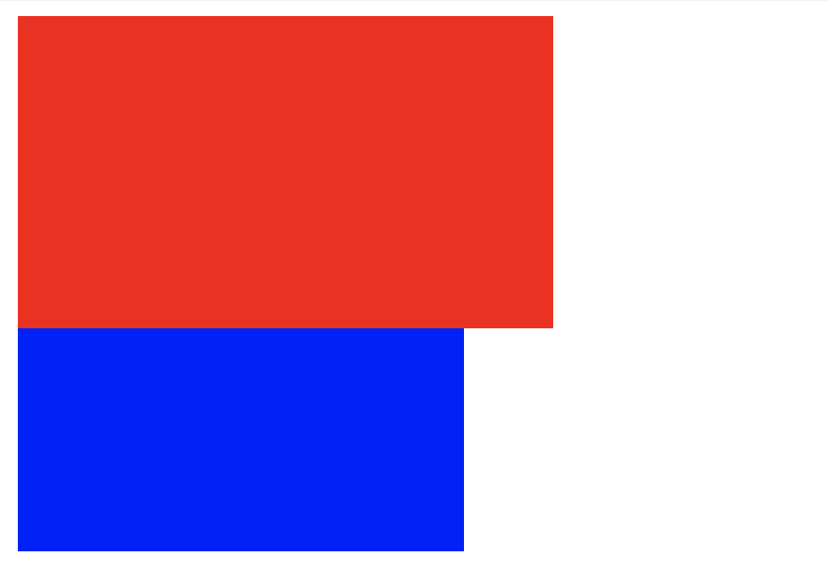
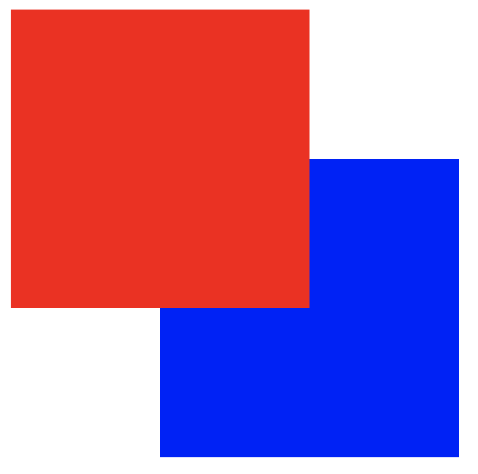

# box-sizing
box-sizingプロパティは, `width`と`height`で指定した幅と高さの領域に, `padding`と`border`の幅と高さを含めるかどうかを決めるプロパティである.

```html
<div class="red-box"></div>
<div class="blue-box"></div>
```

```css
div {
  width: 200px;
  height: 100px;
  padding: 10px;
}

.red-box {
  border: 10px red solid;
  background-color: red;
  box-sizing: content-box; /* `padding`と`border`を含まない(初期値) */
}

.blue-box {
  border: 10px blue solid;
  background-color: blue;
  box-sizing: border-box; /* `padding`と`border`を含む */
}
```

上記のコードを実行すると, 以下の画像のようになる.



red-boxクラスは, `padding`と`border`を含まないので, `width`と`height`の値は200pxと100pxのままである.  
一方blue-boxクラスは, `padding`と`border`を含むので, `width`が160px(200px - 10px \* 4), `height`が60px(100px - 10px \* 4)になる.

# z-index
z-indexプロパティは, 要素の重なりの順序を指定する.  
positionプロパティの値がstatic以外の要素に適応する.  
z-indexプロパティを指定しない場合, 後に宣言された要素が上に重なる.

```html
<div class="red-box"></div>
<div class="blue-box"></div>
```

```css
div {
  position: relative;
  width: 200px;
  height: 200px;
}

.red-box {
  background-color: red;
  top: 0;
  z-index: 2;
}

.blue-box {
  background-color: blue;
  top: -100px;
  left: 100px;
  z-index: 1;
}
```

上記のコードを実行すると, 以下の画像のように先に宣言された要素が上に重なる.



# visibility
visibilityプロパティは, 要素の表示, 非表示を指定する.  

```html
<div class="flex">
  <div class="box bg-red"></div>
  <div class="box bg-blue hidden"></div>
  <div class="box bg-green"></div>
</div>
```

```css
.flex {
  display: flex;
}

.hidden {
  visibility: hidden;
}

.box {
  width: 100px;
  height: 100px;
}

.bg-red {
  background-color: red;
}

.bg-blue {
  background-color: blue;
}

.bg-green {
  background-color: green;
}
```

上記のコードを実行すると, 以下の画像のようになる.


`visibility: hidden;`と同じように非表示にする`display: none`がある.  
2つの違いは, 要素を非表示にするだけか, 要素をなくすかである.  
以下の画像は, 上記のコードの`visibility: hidden;`の箇所を`display: none`に変更した場合の表示結果である.


# CSS設計
CSSは思っているよりも破綻しやすい.  
そのため, ある程度CSSが複雑になることが予想されるのであれば, 初めのうちからCSS設計を導入することをお勧めする.  
CSS設計とは, class名の付け方やCSSファイルの分類に一定のルールを設けることで, 破綻しにくい堅牢なCSSを書くことができる仕組みの総称である.  
CSS設計にも様々な種類があり, 導入の際にはそのプロジェクトに合ったCSS設計を採用すると良い.  
以下はCSS設計の例である.

|設計手法|説明|
|:--|:--|
|**OOCSS**|オブジェクト指向プログラミングの概念を取り入れたCSS設計(Object Oriented CSS).|
|**SMACSS**|OOCSSのコンセプトを元にして考えられたCSS設計.<br>Base, Layout, Module, State, Themeの5つのカテゴリに分けることで, 定義したレイアウトを管理しやすくなる.|
|**BEM**|CSS設計で最も難しいともいえる命名規則において, その問題を解決するために考えられたCSS設計.|
|**MCSS**|OOCSSとBEMのコンセプトを元にして考えられたCSS設計.<br>Foundation, Base, Project, Cosmeticの４つのレイヤーで構成される.|
|**FLOCSS**|上記4つのCSS設計を元にして考えられたCSS設計.<br>Foundation, Layout, Objectの３つのレイヤーと, Objectレイヤーの子レイヤーである, Component, Project, Utilityで構成される.|

今回作成したWebサイトではOOCSSを元にCSSを作成した.  
そのため, OOCSSをもう少し詳しく説明する.

OOCSSは原則として以下の２つを挙げている.

- 構造と見た目の分離
- コンテナーとコンテンツを分離

以下のようなコードがあるとする.

```css
.btn-red {
  padding: 5px 10px;
  background: red;
}

.btn-blue {
  padding: 5px 10px;
  background: blue;
}

.btn-yellow {
  padding: 5px 10px;
  background: yellow;
}
```

このようなコードは`padding: 5px 10px;`が冗長である.  
これを解決するために以下のように修正する.

```css
.btn {
  padding: 5px 10px;
}

.bg-red {
  background: red;
}

.bg-blue {
  background: blue;
}

.bg-yellow {
  background: yellow;
}
```

これが構造と見た目の分離である.  
コンテナーとコンテンツを分離は, 以下のようなコードを修正する.

```css
#header .img {
  width: 250px;
  height: 250px;
}

#footer .img {
  width: 150px;
  height: 150px;
}
```

上記のようなコードは場所に依存してしまっているため, imgオブジェクトを拡張する方がよい.

```css
.img {
  width: 250px;
  height: 250px;
}

.small-img {
  width: 150px;
  height: 150px;
}
```

# レスポンシブ対応
一昔前までは, WebページはPCに対応しておけば問題が無かった.  
しかし現在では, PCの他にもタブレットやスマートフォンなど, 様々なサイズ, 操作性を持ったデバイスが登場している.  
したがって, Webページも様々なデバイスで閲覧されるということである.  
そのため, どのデバイスで閲覧してもレイアウトが崩れずに表示され, それぞれのデバイスに合った操作性を提供することが必要になる.  
それを実現するのがレスポンシブ対応と言われるものである.  

レスポンシブ対応を行うには, HTMLとCSSの両方で設定する必要がある.

まず, HTMLでは`meta`タグに**viewport**の設定を行う.  
詳細は本書のレベルを超えるため説明を省くが, 簡単に説明するとviewportを設定することでスマートフォンなどの携帯型デバイスにも合った表示領域を設定することができる.  
これが上手く設定されていない場合, スマートフォンで閲覧してもPC版の表示がされてしまうことがある.

設定は以下のように行う.  
まず, `meta`タグの`name`属性に`viewport`と値を入れることでviewportの情報を定義する.  
次に, `content`属性には`width=device-width`と`initial-scale=1`を指定する.
`width=device-width`を設定することでデバイスごとにviewportの幅が自動で設定され, `initial-scale=1`を設定することで幅を等倍で表示する(IE以外では基本的にこれがデフォルト値なのだが, IEが生きている限りこの設定を書いておいた方が良いだろう).

```html
<!-- 省略 -->
<head>
  <meta name="viewport" content="width=device-width,initial-scale=1">
</head>
<!-- 省略 -->
```

次に, CSSでは**メディアクエリ**を設定する.  
メディアクエリとは, CSS3で追加された仕様の1つで, ブラウザの画面サイズに応じて適用するスタイルを切り替える機能である.  
メディアクエリの指定方法には大きく分けて３種類存在する.

- `link`タグ内で指定するパターン

```html
<link rel="stylesheet" href="style.css" media="screen and (max-width: 767px)">
```

- `@import`でCSSファイルを読み込む際に指定するパターン

```css
@import url("style.css") screen and (max-width: 767px);
```

- `@media`で指定するパターン  
このパターンが最も用いられる

```css
@media (max-width: 767px) {
  /* 省略 */
}
```

これらのコードは`width`が767px以下のブラウザに対してスタイルが適用される.  
また, `min-width: 768px`と定義すると, `width`が768px以上のブラウザに対してスタイルが適用される.


# CSSの単位
CSSの値の指定で扱える単位は様々あるが, その中でもよく使う単位を以下にまとめた.

|単位|説明|ピクセル換算|
|:--|:--|:--|
|`%`||
|`px`|絶対単位. ピクセル|1px|
|`em`|相対単位. 基準は要素のフォントサイズ|-|
|`rem`|相対単位. 基準はルート要素のフォントサイズ|-|
|`vw`|相対単位. ビューポート幅の1/100|-|
|`vh`|相対単位. ビューポート高さの1/100|-|
